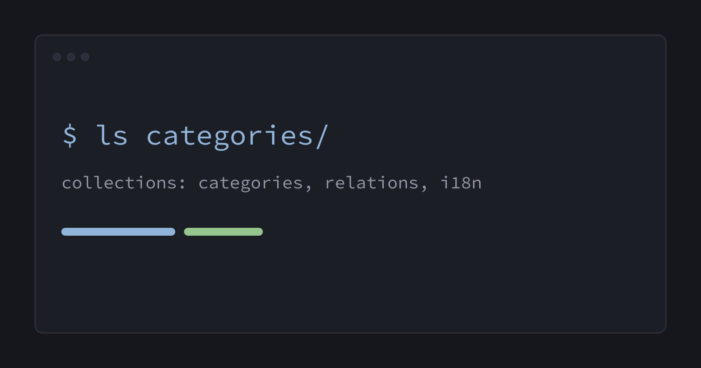

This site's content lives in YAML and Markdown files in git, edited through [Sveltia CMS](https://sveltiacms.app/en/docs). Every save is a commit, and every commit rebuilds the site. I wanted to see how far that goes, so I built a small lab.

> [!NOTE]
> Everything here is temporary. The lab lives at [/lab/](/lab/) and will be reverted.

## Collections

A folder collection is a directory of files, one entry per file. A singleton is a single file with a fixed shape, like the profile behind the home page.

```yaml title="public/admin/config.yml"
collections:
  - name: lab_categories
    folder: src/content/lab/categories
    format: yaml
    reorder: true      # drag-and-drop, writes `order`
```

## Relations

A Relation field stores the slug of an entry in another collection. Posts, projects, notes and glossary terms all point at the same categories, so renaming "DevOps" happens in one place.



## Views

Entry lists can be grouped (by category, kind or year), filtered (pinned, 4+ stars) and sorted. Two collections can share one folder with a `filter`, which is how the Links view only sees notes with `kind: link`.

## Nested folders and translations

The docs collection is a folder tree. The glossary keeps English and Turkish in one file per term.

## Every field type

The [widgets page](/lab/widgets/) uses each field type once, including a list with types that works like a small page builder.
